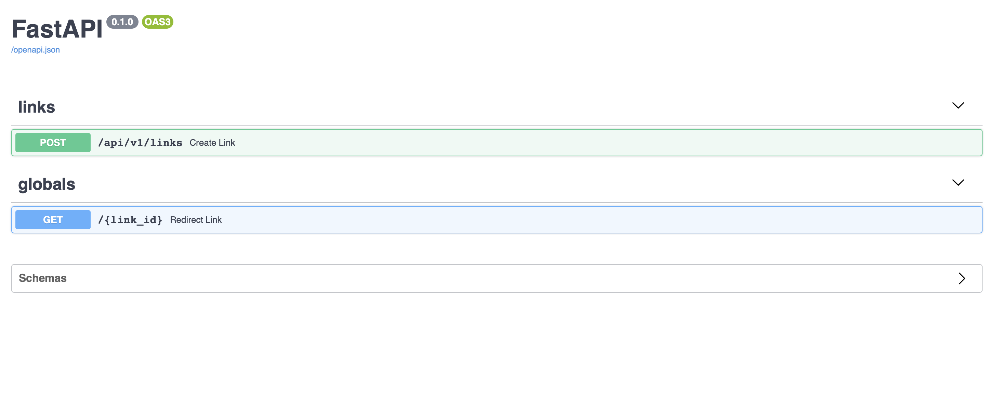
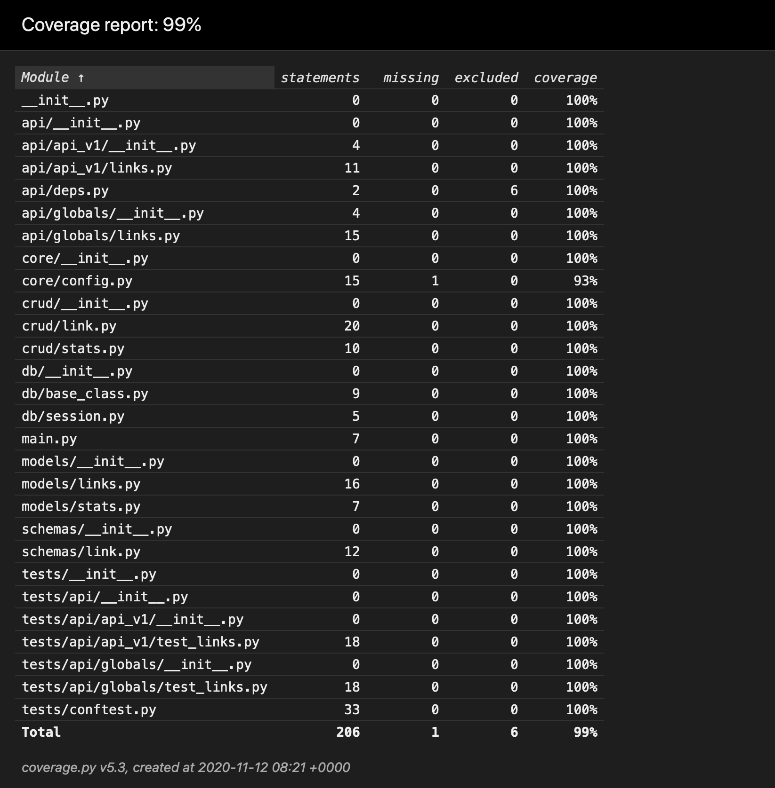

# Link shortener
Very simple API to create own short links.

## Dependency

* Python 3.8
* FastAPI
* SQLAlchemy (Postgresql)
* pipenv

## Run app

`docker-compose up`

## Run tests

`docker-compose -f docker-compose.test.yml run testapi pytest`

## Swagger API docs (local machine)

* localhost:8000/docs

## Coverage

# TODO
* Introduce async
* Add cache (redis)
* Better test setup and cleanup
* Add more requests to the API
* Better domain/default domain setup in create link API
* Website